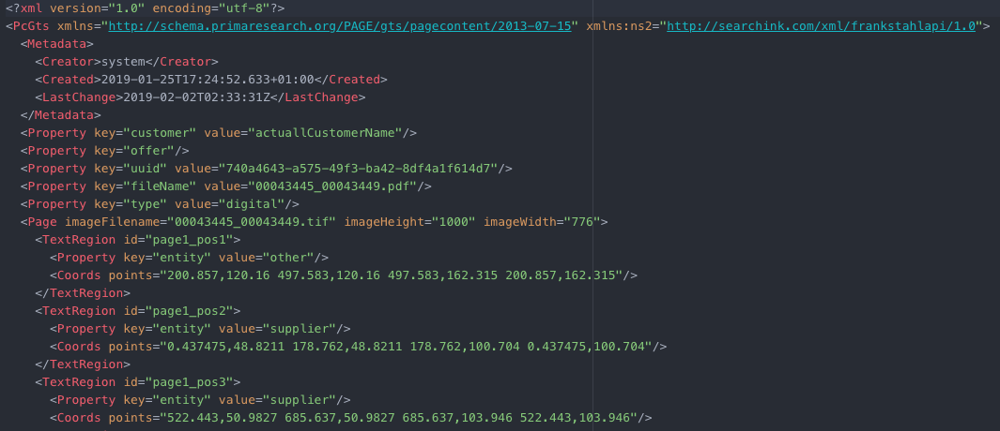
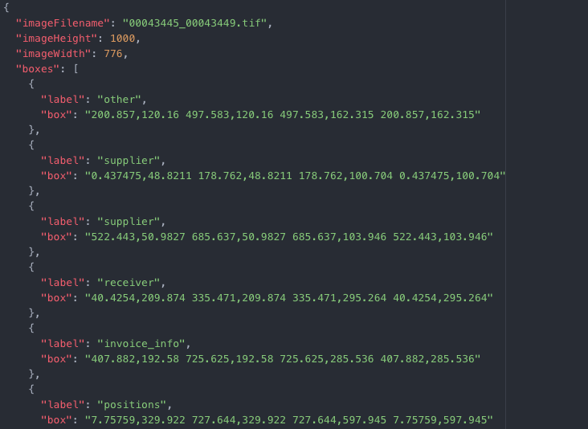
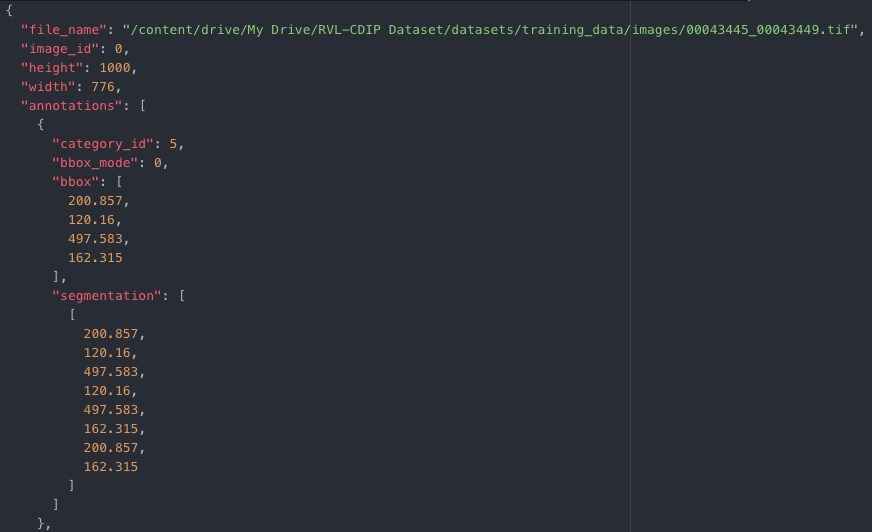
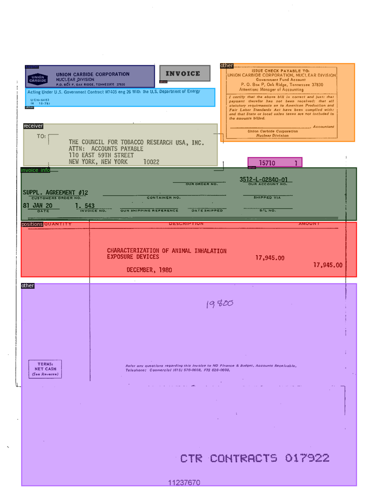
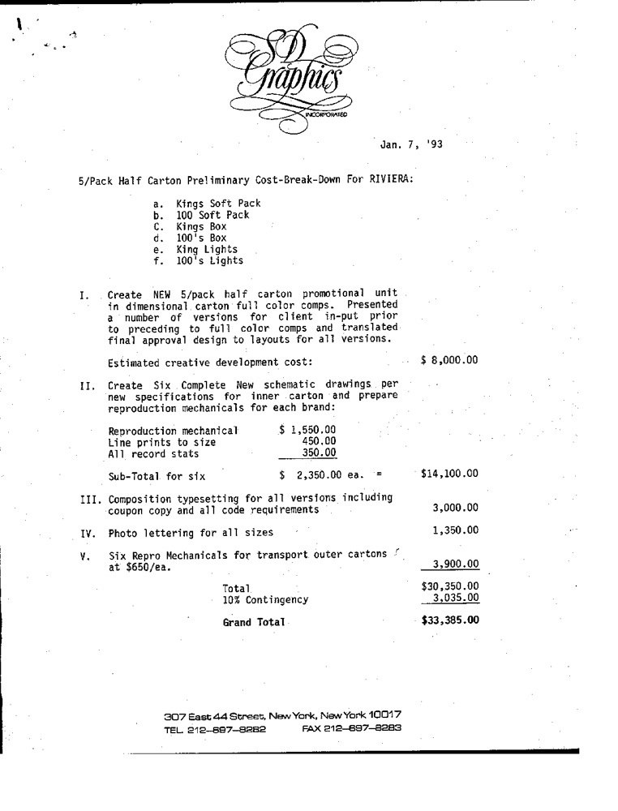
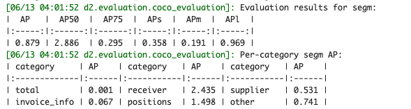
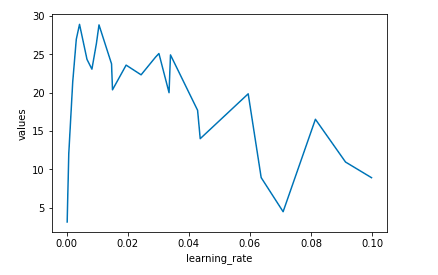
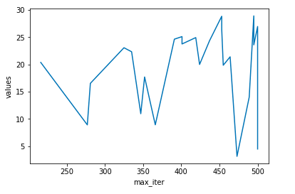
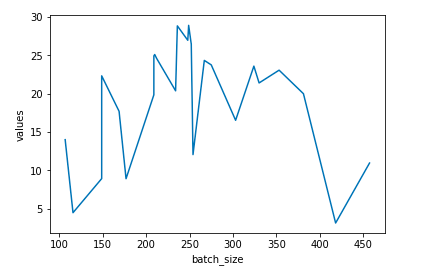
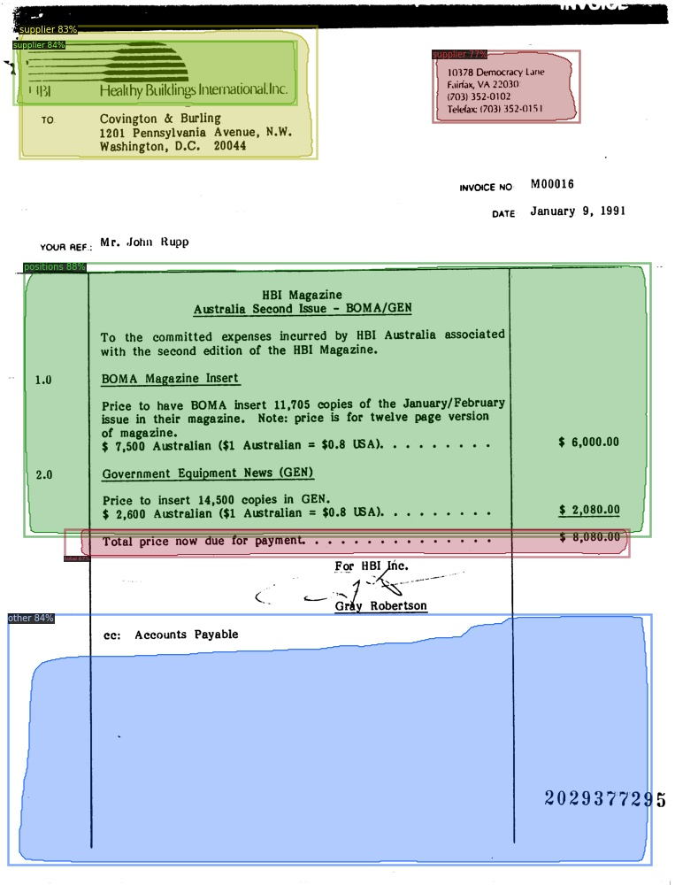

Explanation for using custom datasets
====
I used Google Colab, the free dataset [RVL-CDIP Dataset](https://zenodo.org/record/3257319#.XtzbH577TjB), and [model trained on PubLayNet dataset](https://github.com/hpanwar08/detectron2).   

Reference:                  
・[Official documentation](https://detectron2.readthedocs.io/tutorials/datasets.html)   
・[Explicative article](https://towardsdatascience.com/face-detection-on-custom-dataset-with-detectron2-and-pytorch-using-python-23c17e99e162)   
・[Official tutorial](https://colab.research.google.com/drive/16jcaJoc6bCFAQ96jDe2HwtXj7BMD_-m5#scrollTo=PIbAM2pv-urF)

## Free datasets structure in FUNSD check
        

The RVL-CDIP data was in xml format as above, so it was converted to json format.
        
This is the converted json file; you can see the way of converting it from [this website](https://qiita.com/hiroyuki827/items/bda3141e68e4ef46895a).

* Explanation of json keys:  
 * imageFilename: image file name;
 * imageHeight: image Height;
 * imageWidth: image width;
 * boxes:  boxes have a label and box(xleft,ytop xright,ytop xright,ybottom xleft,ybottom) information for each box.


## Making the function to transform the datasets to standard datasets format


```
def get_data_dicts(img_dir):
    path_1 = '/content/drive/My Drive/RVL-CDIP Dataset/datasets/'
    path_2 = '/annotations/'
    anotation_json_path = path_1 + img_dir + path_2

    path_3 = '/images/'
    image_path = path_1 + img_dir + path_3

    anotation_files = os.listdir(anotation_json_path)

    category_list = {'total': 0, 'receiver': 1, 'supplier': 2, 'invoice_info': 3, 'positions': 4, 'other': 5}

    datas = []
    counter = 0
    for i in anotation_files:
      data_dict = {}
      path_toanotation = anotation_json_path + i
      f = open(path_toanotation, 'r')
      data_json = json.load(f)

      data_dict['file_name'] = image_path + data_json['imageFilename']
      data_dict['image_id'] = counter

      data_dict['height'] = data_json['imageHeight']
      data_dict['width'] = data_json['imageWidth']

      annotations = []
      for i in range(len(data_json['boxes'])):
          annotation = {}

          annotation['category_id'] = category_list[data_json['boxes'][i]['label']]

          box_list = data_json['boxes'][i]['box'].split(' ')
          annotation['bbox_mode'] = BoxMode.XYXY_ABS
          xmin = float((box_list[0].split(',')[0]))
          ymin = float((box_list[0].split(',')[1]))
          xmax = float((box_list[2].split(',')[0]))
          ymax = float((box_list[2].split(',')[1]))

          annotation['bbox'] = [xmin,ymin,xmax,ymax]

          poly = [
            (xmin, ymin), (xmax, ymin),
            (xmax, ymax), (xmin, ymax)
          ]

          poly = list(itertools.chain.from_iterable(poly))

          annotation["segmentation"] = [poly]
          annotations.append(annotation)

      data_dict['annotations'] = annotations
      datas.append(data_dict)
      counter += 1
    return datas
```

* Output of the function:
  


* Explanation of the keys:
 * file_name: the full path to the image file
 * image_id: a unique id that identifies the image
 * height, width: the shape of the image
 * annotations: each dict corresponds to annotations of one instance in the image  
   * bbox: list of 4 numbers representing the bounding box of the instance;
   * category_id: an integer in the range [0, num_categories) representing the category label:
     category_id corresponds to {'answer': 0, 'header': 1, 'question': 2, 'other': 3};
   * bbox_mode: the format of bbox.  
     In this case, BoxMode.XYXY_ABS was chosen because the box represents (x0, y0, x1, y1);
   * segmentation: a list of polygons.
     This segmentation represents the box corners [(xmin, ymin), (xmax, ymin),(xmax, ymax), (xmin, ymax)].

## How to register the function
```
from detectron2.data import DatasetCatalog, MetadataCatalog

for d in ["training_data", "testing_data"]:
  DatasetCatalog.register("data_" + d, lambda d=d: get_data_dicts(d))
  MetadataCatalog.get("data_" + d).set(thing_classes=['total', 'receiver', 'supplier', 'invoice_info', 'positions', 'other'])
data_metadata = MetadataCatalog.get("data_training_data")
```

`DatasetCatalog.register("data_" + d, lambda d=d: get_data_dicts(d))`  
This code registers the function (get_data_dicts) with the name (data_training_data or data_testing_data).

`MetadataCatalog.get("data_" + d).set(thing_classes=['total', 'receiver', 'supplier', 'invoice_info', 'positions', 'other'])`
This code registers the list of names for each category_id.

`data_metadata = MetadataCatalog.get("data_training_data")`
I will later use the data_metadata valid in Visualizer for translating category_id.

## To verify if the data loading is correct, let's visualize the annotations of randomly selected samples in the training set

```
dataset_dicts = get_data_dicts("training_data")
for d in random.sample(dataset_dicts, 3):
    path_to_img = d["file_name"]
    img = cv2.imread(path_to_img)
    visualizer = Visualizer(img[:, :, ::-1], metadata=data_metadata, scale=1)
    vis = visualizer.draw_dataset_dict(d)
    cv2_imshow(vis.get_image()[:, :, ::-1])
```
I set the data_metadata valid in Visualizer  
(the reason of using img[:, :, ::-1] is that the image needs to be in RGB format).   

  


## Fine-tuning a model trained on RVL-CDIP dataset by using parameters that are the same as the [official tutorial](https://colab.research.google.com/drive/16jcaJoc6bCFAQ96jDe2HwtXj7BMD_-m5#scrollTo=PIbAM2pv-urF)
```
from detectron2.engine import DefaultTrainer
from detectron2.config import get_cfg

cfg = get_cfg()
cfg.merge_from_file("/content/drive/My Drive/dataset/configs/DLA_mask_rcnn_X_101_32x8d_FPN_3x.yaml")
cfg.DATASETS.TRAIN = ("data_training_data",)
cfg.DATASETS.TEST = ()
cfg.DATALOADER.NUM_WORKERS = 0
file_path = "/content/drive/My Drive/dataset/configs/model_final_trimmed.pth"
cfg.merge_from_list(['MODEL.WEIGHTS', file_path])
cfg.SOLVER.IMS_PER_BATCH = 2
cfg.SOLVER.BASE_LR = 0.00025
cfg.SOLVER.MAX_ITER = 300    # 300 iterations seems good enough for this toy dataset; you may need to train longer for a practical dataset
cfg.MODEL.ROI_HEADS.BATCH_SIZE_PER_IMAGE = 128   # faster, and good enough for this toy dataset (default: 512)
cfg.MODEL.ROI_HEADS.NUM_CLASSES = 6  # only has one class (ballon)
cfg.OUTPUT_DIR = '/content/drive/My Drive/RVL-CDIP Dataset'

trainer = DefaultTrainer(cfg)
trainer.resume_or_load(resume=False)
trainer.train()
```
`cfg.DATASETS.TRAIN = ("data_training_data",)`
I set the name "data_training_data" registered in DatasetCatalog.

`file_path = "/content/drive/My Drive/dataset/configs/model_final_trimmed.pth`
This is file path to the trained model.

`cfg.merge_from_list(['MODEL.WEIGHTS', file_path])`
I set the model weights.

`cfg.MODEL.ROI_HEADS.NUM_CLASSES = 6`
I set the number of categories. In this case, the number is 6 because there are 6 categories ['total', 'receiver', 'supplier', 'invoice_info', 'positions', 'other'].

## Randomly select several samples to visualize the prediction results.
```
cfg.MODEL.WEIGHTS = os.path.join(cfg.OUTPUT_DIR, "model_final.pth")
cfg.MODEL.ROI_HEADS.SCORE_THRESH_TEST = 0.6   # set the testing threshold for this model
cfg.DATASETS.TEST = ("data_testing_data", )
predictor = DefaultPredictor(cfg)

from detectron2.utils.visualizer import ColorMode
dataset_dicts = get_data_dicts("testing_data")  
for d in random.sample(dataset_dicts, 3):    
    im = cv2.imread(d["file_name"])
    outputs = predictor(im)

    v = Visualizer(im[:, :, ::-1],
                   metadata=data_metadata,
                   scale=1,
                   instance_mode=ColorMode.IMAGE_BW   # remove the colors of unsegmented pixels
    )
    v = v.draw_instance_predictions(outputs["instances"].to("cpu"))
    cv2_imshow(v.get_image()[:, :, ::-1])
```

`cfg.MODEL.WEIGHTS = os.path.join(cfg.OUTPUT_DIR, "model_final.pth")`
I set the fine tuned model.

      

This model can't detect any object when `cfg.MODEL.ROI_HEADS.SCORE_THRESH_TEST = 0.6`.
##  Evaluate the model performance using AP metric implemented in COCO API
```
from detectron2.evaluation import COCOEvaluator, inference_on_dataset
from detectron2.data import build_detection_test_loader
evaluator = COCOEvaluator("data_testing_data", cfg, False, output_dir="./output/")
val_loader = build_detection_test_loader(cfg, "data_testing_data")
inference_on_dataset(trainer.model, val_loader, evaluator)
```
AP50's score was the highest.
[Reference of AP score here](https://medium.com/@jonathan_hui/map-mean-average-precision-for-object-detection-45c121a31173)



## Setting of the best parameters using optuna

```
def objective(trial):
  cfg = get_cfg()
  cfg.merge_from_file("/content/drive/My Drive/dataset/configs/DLA_mask_rcnn_X_101_32x8d_FPN_3x.yaml")
  cfg.DATASETS.TRAIN = ("data_training_data",)
  cfg.DATASETS.TEST = ()
  cfg.DATALOADER.NUM_WORKERS = 0
  file_path = "/content/drive/My Drive/dataset/configs/model_final_trimmed.pth"
  cfg.merge_from_list(['MODEL.WEIGHTS', file_path])

  cfg.SOLVER.IMS_PER_BATCH = 2

  learning_rate = trial.suggest_uniform('learning_rate', 0.0001, 0.1)
  cfg.SOLVER.BASE_LR = learning_rate  # pick a good LR

  max_iter = trial.suggest_int('max_iter', 200, 500)
  cfg.SOLVER.MAX_ITER = max_iter    # 300 iterations seems good enough for this toy dataset; you may need to train longer for a practical dataset

  batch_size = trial.suggest_int('batch_size', 100, 500)
  cfg.MODEL.ROI_HEADS.BATCH_SIZE_PER_IMAGE = batch_size   # faster, and good enough for this toy dataset (default: 512)

  cfg.MODEL.ROI_HEADS.NUM_CLASSES = 6  # only has one class (ballon)
  cfg.OUTPUT_DIR = '/content/drive/My Drive/RVL-CDIP Dataset'

  trainer = DefaultTrainer(cfg)
  trainer.resume_or_load(resume=False)
  print('tarin result')
  trainer.train()

  evaluator = COCOEvaluator("data_testing_data", cfg, False, output_dir="./output/")
  val_loader = build_detection_test_loader(cfg, "data_testing_data")
  result = inference_on_dataset(trainer.model, val_loader, evaluator)
  return result['segm']['AP50']
```
I searched for the best parameters for learning_rate, max_iter, batch_size.
The above function returns the AP50 of the model.

```
study = optuna.create_study(direction = 'maximize')
study.optimize(objective, n_trials=25)
study.best_params
```

Optuna executed the above function 25 times and found the best parameters (below).
* learning_rate: 0.01631995181695812  
* max_iter: 477  
* batch_size: 298    
* The score(AP50) is 32.30762353926934.

If you change n_trials to 40, optuna will run 40 times to find the best parameter.

In addition, I showed which parameters are best at learning_rate, max_iter, batch_size.
The example code below is for learning_rate.
```
import matplotlib.pyplot as plt
from operator import itemgetter

values = [each.value for each in study.trials]
learning_rate = [each.params['learning_rate'] for each in study.trials]
max_iter = [each.params['max_iter'] for each in study.trials]
batch_size = [each.params['batch_size'] for each in study.trials]

lists = list(zip(learning_rate, values))
lists.sort(key=itemgetter(0))
new_learning_rate, new_values = list(zip(*lists))

plt.plot(new_learning_rate, new_values)
plt.xlabel('learning_rate')
plt.ylabel('values')
plt.show()
```

      

0.1 ~ 0.2 learning rate is good, because values(AP50) are high.   

```
lists = list(zip(max_iter, values))
lists.sort(key=itemgetter(0))
new_max_iter, new_values = list(zip(*lists))

plt.plot(new_max_iter, new_values)
plt.xlabel('max_iter')
plt.ylabel('values')
plt.show()
```

    

400 ~ 450 max_iter is good, because values(AP50) are high.

```
lists = list(zip(batch_size, values))
lists.sort(key=itemgetter(0))
new_batch_size, new_values = list(zip(*lists))

plt.plot(new_batch_size, new_values)
plt.xlabel('batch_size')
plt.ylabel('values')
plt.show()
```

  

200 ~ 350 batch_size is good, because values(AP50) are high.

To understand optuna more, check [here](https://optuna.readthedocs.io/en/latest/tutorial/first.html).


## Confirm the performance after optimization
I fine tune again by using the best parameters.

```
from detectron2.engine import DefaultTrainer
from detectron2.config import get_cfg

cfg = get_cfg()
cfg.merge_from_file("/content/drive/My Drive/dataset/configs/DLA_mask_rcnn_X_101_32x8d_FPN_3x.yaml")
cfg.DATASETS.TRAIN = ("data_training_data",)
cfg.DATASETS.TEST = ()
cfg.DATALOADER.NUM_WORKERS = 0
file_path = "/content/drive/My Drive/dataset/configs/model_final_trimmed.pth"
cfg.merge_from_list(['MODEL.WEIGHTS', file_path])
cfg.SOLVER.IMS_PER_BATCH = 2
cfg.SOLVER.BASE_LR = 0.016
cfg.SOLVER.MAX_ITER = 477    # 300 iterations seems good enough for this toy dataset; you may need to train longer for a practical dataset
cfg.MODEL.ROI_HEADS.BATCH_SIZE_PER_IMAGE = 298   # faster, and good enough for this toy dataset (default: 512)
cfg.MODEL.ROI_HEADS.NUM_CLASSES = 6  # only has one class (ballon)
cfg.OUTPUT_DIR = '/content/drive/My Drive/RVL-CDIP Dataset'

trainer = DefaultTrainer(cfg)
trainer.resume_or_load(resume=False)
trainer.train()
```

Inference & evaluation using the trained model:
```
cfg.MODEL.WEIGHTS = os.path.join(cfg.OUTPUT_DIR, "model_final.pth")
cfg.MODEL.ROI_HEADS.SCORE_THRESH_TEST = 0.6   # set the testing threshold for this model
cfg.DATASETS.TEST = ("data_testing_data", )
predictor = DefaultPredictor(cfg)
```

```
from detectron2.utils.visualizer import ColorMode
dataset_dicts = get_data_dicts("testing_data")
for d in random.sample(dataset_dicts, 3):    
    im = cv2.imread(d["file_name"])
    outputs = predictor(im)

    v = Visualizer(im[:, :, ::-1],
                   metadata=data_metadata,
                   scale=1,
                   instance_mode=ColorMode.IMAGE_BW   # remove the colors of unsegmented pixels
    )
    v = v.draw_instance_predictions(outputs["instances"].to("cpu"))
    cv2_imshow(v.get_image()[:, :, ::-1])
```
  

The model was improved and can detect question and answer labels with high prediction scores.
