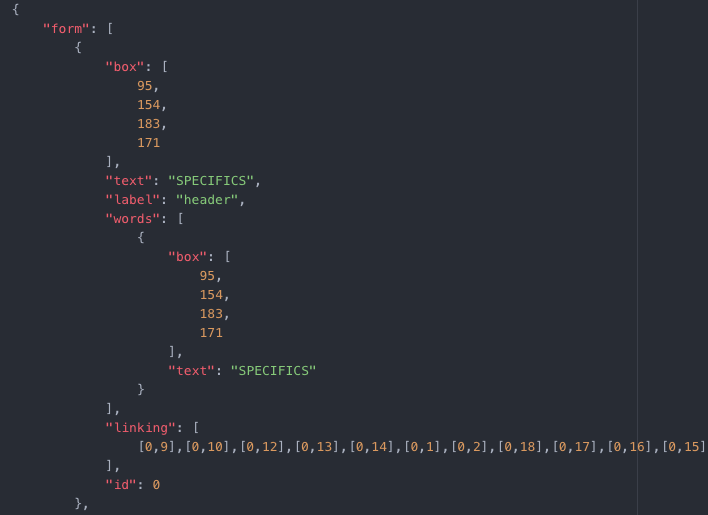
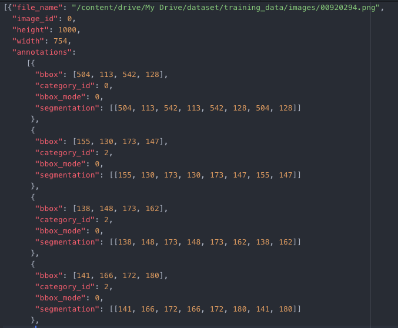
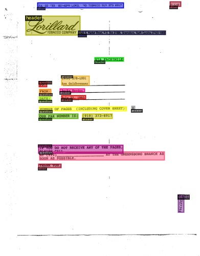
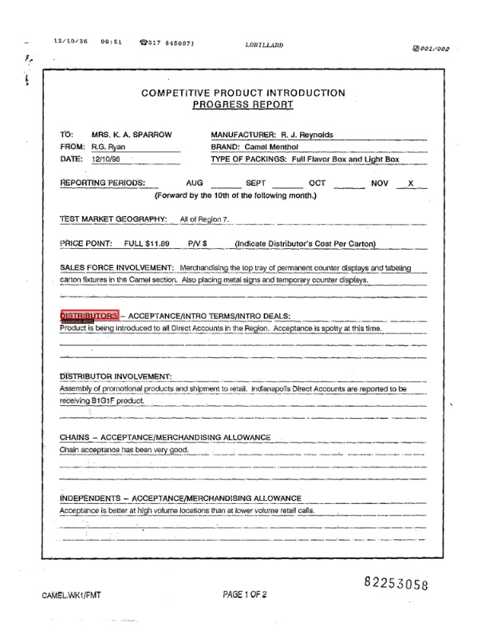
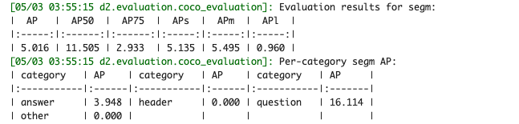

Explanation for using custom datasets
====
Used google colab and the free datasets:[FUNSD](https://guillaumejaume.github.io/FUNSD/)  
You can access the codes described below in google colab from [this link](https://colab.research.google.com/drive/1Hp3AdzxaUQmGF92IEt5z9RK0x95P6Q0w)  
Reference:  
[official documentation](https://detectron2.readthedocs.io/tutorials/datasets.html)  , [good article](https://towardsdatascience.com/face-detection-on-custom-dataset-with-detectron2-and-pytorch-using-python-23c17e99e162)
, [official tutorial](https://colab.research.google.com/drive/16jcaJoc6bCFAQ96jDe2HwtXj7BMD_-m5#scrollTo=PIbAM2pv-urF)
## Check the free datasets structure in FUNSD
  

* Explanation of json keys  
 * box: (xlef t, ytop, xright, ybottom)  
 * text: text in the box area  
 * label: label of the box  
(there are 4 kinds of labels ['answer', 'header', 'question', 'other'])
 * words:  a group of words that belong together in the text
 * linking: formatted as [id_from rom, id_to], where id represents the
semantic entity identifier
 * id: id of the box　　

 You can check the detail in [the pdf](https://arxiv.org/pdf/1905.13538.pdf).


## Make the function to tranform the datasets to standard datasets format


```
def get_data_dicts(img_dir):
    path_1 = '/content/drive/My Drive/dataset/'
    path_2 = '/annotations/'
    anotation_json_path = path_1 + img_dir + path_2

    path_3 = '/images/'
    image_path = path_1 + img_dir + path_3

    anotation_files = os.listdir(anotation_json_path)

    #category list
    category_list = {'answer': 0, 'header': 1, 'question': 2, 'other': 3}

    datas = []
    counter = 0
    for i in anotation_files:
        data_dict = {}
        path_toanotation = anotation_json_path + i
        f = open(path_toanotation, 'r')
        data_json = json.load(f)

        imgfile_name = i.split('.')[0] + '.png'

        data_dict['file_name'] = image_path + imgfile_name
        data_dict['image_id'] = counter

        inputimg_shape = cv2.imread(image_path + imgfile_name).shape[:2]

        data_dict['height'] = inputimg_shape[0]
        data_dict['width'] = inputimg_shape[1]

        annotations = []
        for i in range(len(data_json['form'])):
            annotation = {}
            annotation['bbox'] = data_json['form'][i]['box']

            annotation['category_id'] = category_list[data_json['form'][i]['label']]
            annotation['bbox_mode'] = BoxMode.XYXY_ABS
            xmin = int(data_json['form'][i]['box'][0])
            ymin = int(data_json['form'][i]['box'][1])
            xmax = int(data_json['form'][i]['box'][2])
            ymax = int(data_json['form'][i]['box'][3])

            poly = [
              (xmin, ymin), (xmax, ymin),
              (xmax, ymax), (xmin, ymax)
            ]

            poly = list(itertools.chain.from_iterable(poly))

            annotation["segmentation"] = [poly]
            annotations.append(annotation)

        data_dict['annotations'] = annotations
        datas.append(data_dict)
        counter += 1
    return datas
```

* Output of the function
  


* Explanation of the keys
 * file_name: the full path to the image file
 * image_id: a unique id that identifies this image
 * height, width: the shape of image
 * annotations: each dict corresponds to annotations of one instance in this image  
   * bbox: list of 4 numbers representing the bounding box of the instance
   * category_id: an integer in the range [0, num_categories) representing the category label.
     category_id corresponds to {'answer': 0, 'header': 1, 'question': 2, 'other': 3}
   * bbox_mode: the format of bbox  
     I chose BoxMode.XYXY_ABS because my box represents (x0, y0, x1, y1)
   * segmentation: it represents a list of polygon.
     I made a segmentation which represents the box corners [(xmin, ymin), (xmax, ymin),(xmax, ymax), (xmin, ymax)]

## How to register the function
```
from detectron2.data import DatasetCatalog, MetadataCatalog

for d in ["training_data", "testing_data"]:
  DatasetCatalog.register("data_" + d, lambda d=d: get_data_dicts(d))
  MetadataCatalog.get("data_" + d).set(thing_classes=['answer', 'header', 'question', 'other'])
data_metadata = MetadataCatalog.get("data_train_data")
```

`DatasetCatalog.register("data_" + d, lambda d=d: get_data_dicts(d))`  
This code registers the function (get_data_dicts()) with the name (data_training_data or data_testing_data).

`MetadataCatalog.get("data_" + d).set(thing_classes=['answer', 'header', 'question', 'other'])`
This code registers the list of names for each category_id.

`data_metadata = MetadataCatalog.get("data_train_data")`
I will later use the data_metadata valid in Visualizer for translating category_id.

## To verify if the data loading is correct, let's visualize the annotations of randomly selected samples in the training set

```
dataset_dicts = get_balloon_dicts("balloon/train")
for d in random.sample(dataset_dicts, 3):
    img = cv2.imread(d["file_name"])
    visualizer = Visualizer(img[:, :, ::-1], metadata=balloon_metadata, scale=0.5)
    vis = visualizer.draw_dataset_dict(d)
    cv2_imshow(vis.get_image()[:, :, ::-1])
```
I set the data_metadata valid in Visualizer  
(The reason of using img[:, :, ::-1] is that the image needs to be in RGB format).

  


## Fine-tune a coco-pretrained R50-FPN Mask R-CNN model
```
from detectron2.engine import DefaultTrainer
from detectron2.config import get_cfg

cfg = get_cfg()
cfg.merge_from_file(model_zoo.get_config_file("COCO-InstanceSegmentation/mask_rcnn_R_50_FPN_3x.yaml"))
cfg.DATASETS.TRAIN = ("data_training_data",)
cfg.DATASETS.TEST = ()
cfg.DATALOADER.NUM_WORKERS = 0
cfg.MODEL.WEIGHTS = model_zoo.get_checkpoint_url("COCO-InstanceSegmentation/mask_rcnn_R_50_FPN_3x.yaml")  # Let training initialize from model zoo
cfg.SOLVER.IMS_PER_BATCH = 2
cfg.SOLVER.BASE_LR = 0.00025  # pick a good LR
cfg.SOLVER.MAX_ITER = 300    # 300 iterations seems good enough for this toy dataset; you may need to train longer for a practical dataset
cfg.MODEL.ROI_HEADS.BATCH_SIZE_PER_IMAGE = 128   # faster, and good enough for this toy dataset (default: 512)
cfg.MODEL.ROI_HEADS.NUM_CLASSES = 4  # only has one class (ballon)

os.makedirs(cfg.OUTPUT_DIR, exist_ok=True)
trainer = DefaultTrainer(cfg)
trainer.resume_or_load(resume=False)
trainer.train()
```

`cfg.DATASETS.TRAIN = ("data_training_data",)`
I set the name "data_training_data" registered in DatasetCatalog.

`cfg.MODEL.ROI_HEADS.NUM_CLASSES = 4`
I set the number of categories. In this case, the number is 4 because there are 4 categories ['answer', 'header', 'question', 'other'].

## Randomly select several samples to visualize the prediction results.
```
cfg.MODEL.WEIGHTS = os.path.join(cfg.OUTPUT_DIR, "model_final.pth")
cfg.MODEL.ROI_HEADS.SCORE_THRESH_TEST = 0.4   # set the testing threshold for this model
cfg.DATASETS.TEST = ("data_testing_data", )
predictor = DefaultPredictor(cfg)

from detectron2.utils.visualizer import ColorMode
dataset_dicts = get_data_dicts("testing_data")
for d in random.sample(dataset_dicts, 3):    
    im = cv2.imread(d["file_name"])
    outputs = predictor(im)

    v = Visualizer(im[:, :, ::-1],
                   metadata=data_metadata,
                   scale=0.8,
                   instance_mode=ColorMode.IMAGE_BW   # remove the colors of unsegmented pixels
    )
    v = v.draw_instance_predictions(outputs["instances"].to("cpu"))
    cv2_imshow(v.get_image()[:, :, ::-1])
```

`cfg.MODEL.WEIGHTS = os.path.join(cfg.OUTPUT_DIR, "model_final.pth")`
I set the fine tuned model.

  

##  Evaluate its performance using AP metric implemented in COCO API
```
from detectron2.evaluation import COCOEvaluator, inference_on_dataset
from detectron2.data import build_detection_test_loader
evaluator = COCOEvaluator("balloon_val", cfg, False, output_dir="./output/")
val_loader = build_detection_test_loader(cfg, "balloon_val")
inference_on_dataset(trainer.model, val_loader, evaluator)
# another equivalent way is to use trainer.test
```
AP50's score was the best

  
